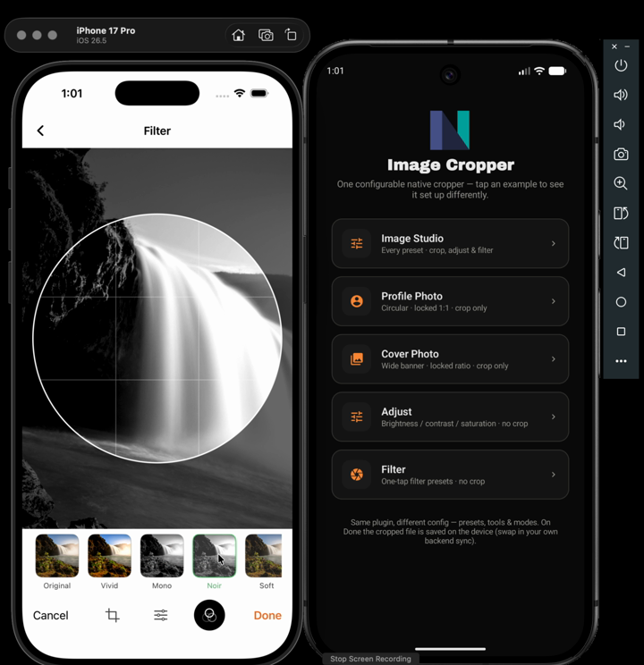

# Image Cropper — NativePHP Mobile Demo

A [NativePHP Mobile](https://nativephp.com/docs/mobile) demo app that showcases the
[`vipertecpro/image-cropper`](https://github.com/vipertecpro/image-cropper) plugin — a
fully native, hand-written image cropper & editor for iOS and Android.

The home screen is a gallery of **five examples**, each opening the *same* plugin
configured differently — from a full-featured studio down to a bare, locked cropper —
to show how one plugin covers many real use cases.

## Demo

[](art/demo.mp4)

▶️ **[Watch the full demo](art/demo.mp4)** — a walkthrough of the five examples on iOS.

## Screenshots

| Home (examples) | Image Studio | Profile Photo |
|:---:|:---:|:---:|
|  |  |  |

> Screenshots live in [`art/`](art/) — drop your own captures there (see that folder's note for filenames).

## The examples

| Screen | Configuration | Use case |
|---|---|---|
| **Image Studio** | everything on (all presets, crop + adjust + filter) | a full editor |
| **Profile Photo** | `preset: profile`, `presets: []`, `modes: ['crop']` | locked circular avatar |
| **Cover Photo** | `preset: cover`, `presets: []`, `modes: ['crop']` | locked wide banner |
| **Adjust** | `modes: ['adjust']` | colour-adjust the whole photo, no crop |
| **Filter** | `modes: ['filter']` | one-tap filters on the whole photo, no crop |

Each is a thin `NativeComponent` that shares one trait,
[`App\Concerns\InteractsWithImageCropper`](app/Concerns/InteractsWithImageCropper.php),
and only declares:

```php
protected function cropperOptions(): array  { return ['preset' => 'profile', 'presets' => [], 'modes' => ['crop']]; }
protected function storageDirectory(): string { return 'avatars'; }                         // its own device folder
protected function uploadEndpoint(): ?string  { return 'https://your-api.example.com/api/user/avatar'; } // its own API route
```

## How the flow works

1. Tap **Edit** → pick a photo → the native crop editor opens **immediately**.
2. Adjust / crop / filter, then tap **Done**.
3. The plugin returns a real cropped file; the trait's `persistCroppedImage()` saves it
   into that screen's folder (and is ready to POST it to that screen's endpoint), then
   the preview updates.

The storage/backend hook is the single integration point — see
[`persistCroppedImage()`](app/Concerns/InteractsWithImageCropper.php). It keeps a copy on
device by default, with a fully-commented `Http` upload ready to enable.

## Running it

**Requirements:** PHP 8.4, [NativePHP Mobile](https://nativephp.com/docs/mobile/4/getting-started/installation)
set up (Xcode for iOS, Android Studio for Android).

```bash
git clone https://github.com/vipertecpro/supernativephp-image-manipulation
cd supernativephp-image-manipulation
composer install

# then build & run on a simulator/emulator (pick one):
php artisan native:run ios
php artisan native:run android
```

The `vipertecpro/image-cropper` plugin installs automatically via Composer and is
registered in [`app/Providers/NativeServiceProvider.php`](app/Providers/NativeServiceProvider.php).

## Tests

```bash
php artisan test
```

## License

MIT.
